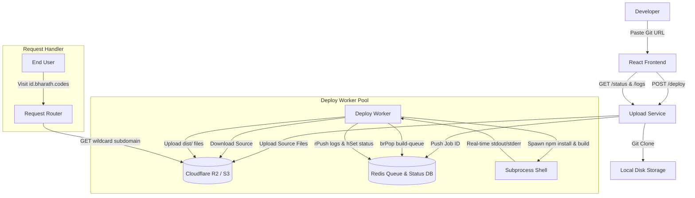

# DeployX

DeployX is a local-first, decentralized auto-deployment platform (similar to Vercel/Netlify) featuring a high-performance React operator console, a repository uploader service, an asynchronous build worker pool, and a wildcard subdomain request router.

The platform is designed to clone Git repositories, automatically execute dependencies installation and build pipelines, stream logs line-by-line in real-time to a dashboard console, and route requests dynamically to compiled static assets from object storage.

---

## High-Level Architecture



---

## What This Repo Contains

- `frontend/` - React console dashboard with newsreader/mono styling, terminal log widget, and deploy workflows
- `uploadService/` - Exposes deployment endpoints, handles cloning, S3 uploading, and queuing
- `deployService/` - Asynchronous queue worker that spawns build environments and uploads compiled assets
- `reqHandler/` - Wildcard subdomain proxy router streaming active websites from object storage
- `README.md` - this guide

---

## Core Flow

1. **Submit Repository**: Paste any public frontend GitHub repository URL in the DeployX UI.
2. **Clone & Source Upload**: The `uploadService` clones the repository locally, strips `.git` metadata/`node_modules`, uploads all source files to Cloudflare R2/S3 under the path `output/<id>/`, and sets status to `uploaded`.
3. **Queue Task**: The uploader pushes the deployment ID into a Redis queue list (`build-queue`).
4. **Log Collection**: The backend initiates log tracking, piping status steps directly to a Redis list (`logs:<id>`).
5. **Worker Execution**: The `deployService` worker pops the ID from Redis, downloads the source files from storage, and spawns subprocesses to run:
   - `npm install`
   - `npm run build`
6. **Live Streaming**: The subprocesses stdout/stderr streams are split by newlines and piped back to Redis `logs:<id>` in real-time. The frontend console polls this endpoint and auto-scrolls the active build outputs.
7. **Production Upload**: The worker copies the local `dist/` build files, uploads them to `dist/<id>/` in object storage, and updates status to `deployed`.
8. **Subdomain Proxying**: The user visits the sandbox link (`http://<id>.bharath.codes:3001`). The `reqHandler` extracts the sub-domain identifier, reads the corresponding files from storage, and streams them back to the client.

---

## Service Layout & Technology Stack

| Layer | Service Folder | Technology / Packages |
|---|---|---|
| **Frontend Console** | `frontend/` | React 19, Vite, Motion, Axios, TailwindCSS, Sora & IBM Plex Mono Typography |
| **API & Upload Server** | `uploadService/` | Express, Simple-Git, Redis Client, AWS-SDK |
| **Asynchronous Worker** | `deployService/` | Node Child Processes (`spawn`), Redis Client, AWS-SDK |
| **Request Proxy** | `reqHandler/` | Express, AWS-SDK |
| **Datastore / Queues** | Local / Cloud | Redis (List & Hash namespaces) |
| **Object Storage** | Local / Cloud | S3-Compatible Storage (Cloudflare R2 recommended) |

---

## Local Setup

### Prerequisites

- Node.js 20+ installed
- Redis server running locally (`redis://127.0.0.1:6379`)
- Cloudflare R2 bucket (or AWS S3 bucket) created (e.g. named `vercel-clone`)

---

### Step 1: Storage Environment Configuration

You must create a `.env` file in the following service folders:
- `uploadService/.env`
- `deployService/.env`
- `reqHandler/.env`

Use this structure:

```env
ACCESS=your_access_key_id
SECRET=your_secret_access_key
ENDPOINT=https://your-account-id.r2.cloudflarestorage.com
BUCKET=vercel-clone
REDIS_URL=redis://127.0.0.1:6379
```

---

### Step 2: Boot Backend Services

Open three terminal sessions to run each backend component:

#### 1. Start the Upload Service
```bash
cd uploadService
npm install
npm run build
node dist/index.js
# Runs on Port 3000
```

#### 2. Start the Build Worker
```bash
cd deployService
npm install
npm run build
node dist/index.js
# Pulls jobs from Redis build-queue
```

#### 3. Start the Subdomain Request Proxy
```bash
cd reqHandler
npm install
npm run build
node dist/index.js
# Runs on Port 3001
```

---

### Step 3: Run the Frontend App

1. Create a `frontend/.env` file if you want to override the default upload base URL (optional):
   ```env
   VITE_BACKEND_UPLOAD_URL=http://localhost:3000
   ```
2. Launch the developer interface:
   ```bash
   cd frontend
   npm install
   npm run dev
   ```
3. Open `http://localhost:5173` in your browser.

---

## Operational Details

- **Redis Key Expiry**: To optimize Redis database memory overhead, deployment logs cached inside `logs:<id>` lists are configured to automatically expire 1 hour after execution ends.
- **Port Mapping**:
  - `http://localhost:3000` -> Upload Service Endpoint
  - `http://localhost:3001` -> Subdomain Proxy Router
  - `http://localhost:5173` -> Developer Console UI
- **Wildcard Subdomains**: In production, configure Nginx to route `*.yourdomain.com` to port `3001`. For local testing, requests containing host headers like `http://<id>.localhost:3001` will serve the mapped deployment matching the ID prefix.
